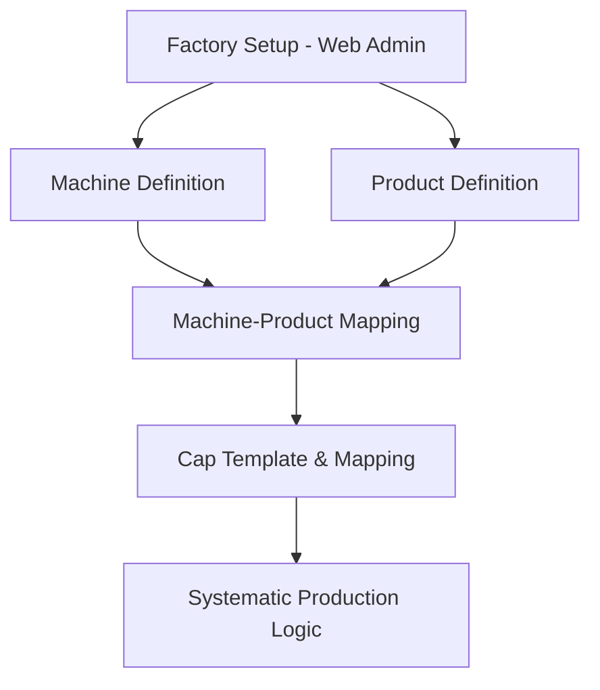

# Configuration Workflow Architecture

The Configuration workflow defines the static data and "Digital Twin" of the Paul and Sons factory. This administrative setup on the web interface is the foundation for all production, inventory, and sales logic.

## Process Overview

---

## 1. Core Definitions (Web Interface)
**Primary Actor:** Administrator
**Tool:** `apps/web/app/(authenticated)/machines/page.js` & `products/page.js`

### Factories & Machines
- **Factories:** Define physical locations (e.g., Factory A, Factory B).
- **Machines:** Define manufacturing assets (e.g., JSW 180T, Toshiba 250T). Machines are assigned to a specific factory.

### Product Catalog
- **Products:** Define the high-level item names (e.g., 5L Tub, 1L Cap).
- **Attributes:** Each product has sizes and color variants.
- **Ideal Weight:** This is the most critical configuration field. It is used to back-calculate the quantity from the net weight produced in the daily logs.

---

## 2. Machine-Product Mapping (Web Interface)
**Primary Actor:** Administrator
**Tool:** `apps/web/app/(authenticated)/die-mappings/page.js`

To prevent errors on the factory floor, the system restricts which products can be logged on which machines.

- **Objective:** Linking a specific machine to the products it is capable of manufacturing.
- **Usage:** In the mobile app, when a PM selects a machine, only the mapped products appear in the dropdown.

---

## 3. Cap Mapping System (Web Interface)
**Primary Actor:** Administrator
**Tool:** `apps/web/app/(authenticated)/cap-mappings/page.js`

Caps require more complex configuration due to high-speed production and 1-to-many relationship with machines.

- **Template System:** Defines a cap design independently of the machine.
- **Mapping:** One Cap Template can be mapped to multiple machines.
- **Cycle Time:** Each mapping defines the specific "Cycle Time" (in seconds) for that Cap on that specific Machine.
- **Reporting:** This data allows for calculating "Theoretical Yield" vs. "Actual Yield" in production reports.

---

## Key Rules & Constraints
- **Inheritance:** Machines inherit the `factory_id` from their parent factory setup.
- **Weight Accuracy:** If an "Ideal Weight" is configured incorrectly, all inventory balances derived from production logs will be flawed.
- **Mapping Consistency:** A product cannot be logged in the mobile app if it hasn't been mapped to at least one machine on the web interface.
- **Admin Control:** Configuration data is strictly restricted to the **Administrator** role to prevent accidental changes on the factory floor.
