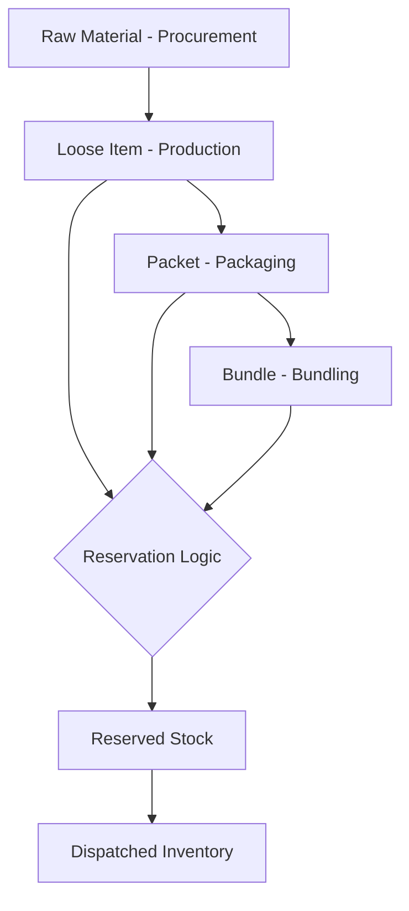

# Inventory Workflow Architecture

The Inventory system manages the transformation of raw materials into finished, packaged, and reserved stock. It uses a state-machine approach to prevent double-counting and ensures physical storage states are accurately reflected.

## Process Overview

---

## 1. Stock States & Transformations
Inventory units exist in one of three primary physical states, with transformations typically performed via the **Mobile App**:

### Loose (Production State)
- **Source:** Output of a production machine.
- **Unit:** Individual units (e.g., 1 Tub).
- **Transformation:** Can be moved into a **Packet**.

### Packet (Packaging State)
- **Source:** Created from a fixed quantity of **Loose** items.
- **Unit:** Packets (e.g., 1 Packet of 50 Tubs).
- **Transformation:** Can be moved into a **Bundle**.

### Bundle (Finished State)
- **Source:** Created from a fixed quantity of **Packets**.
- **Unit:** Bundles (e.g., 1 Bundle of 10 Packets).
- **Outcome:** Typically the state for dispatching larger orders.

---

## 2. The Reservation Mechanism
**Actor:** Production Manager
**Tool:** `apps/mobile/lib/features/production/screens/order_preparation_screen.dart`

Reservation is the technical locking of inventory to a specific sales order item. Unlike automated systems, this is a **MANUAL, INTENTIONAL** step in the Paul and Sons workflow.

- **Trigger:** PM clicks **"Reserve & Forward to Dispatch"**.
- **Service Logic:** The system searches for matching inventory units in the requested state (`loose`, `packet`, or `bundle`).
- **Locking:** Available units are marked as `reserved = true` and linked to the `sales_order_item_id`.
- **Visibility:** Reserved stock is subtracted from "Available" totals on the dashboards to prevent over-selling.

---

## 3. Dispatch & Clearance
**Actor:** Administrator
**Tool:** `apps/web/app/(authenticated)/deliveries/page.js`

The final stage in the inventory lifecycle occurs when the goods physically leave the factory.

- **Action:** Admin marks the order as `delivered`.
- **System Impact:** The linked reserved inventory units are moved to a `dispatched` state or removed from the active balance.
- **Financial Handoff:** Inventory clearance triggers the final ledger entry for the customer's sale.

---

## Key Rules & Constraints
- **State Selection:** A single Sales Order can be fulfilled by mixing states (e.g., 2 Bundles + 5 Loose Tubs).
- **Backorder Handoff:** Items in a backordered state cannot be reserved until they are manufactured and "Marked as Prepared".
- **Real-Time Balances:** All dashboards show **Total Stock**, **Reserved Stock**, and **Available Stock** (Total - Reserved).
- **Multi-Factory Stocks:** Inventory is tracked per `factory_id`, and stock is typically reserved from the factory where the Production Manager is authorized.
