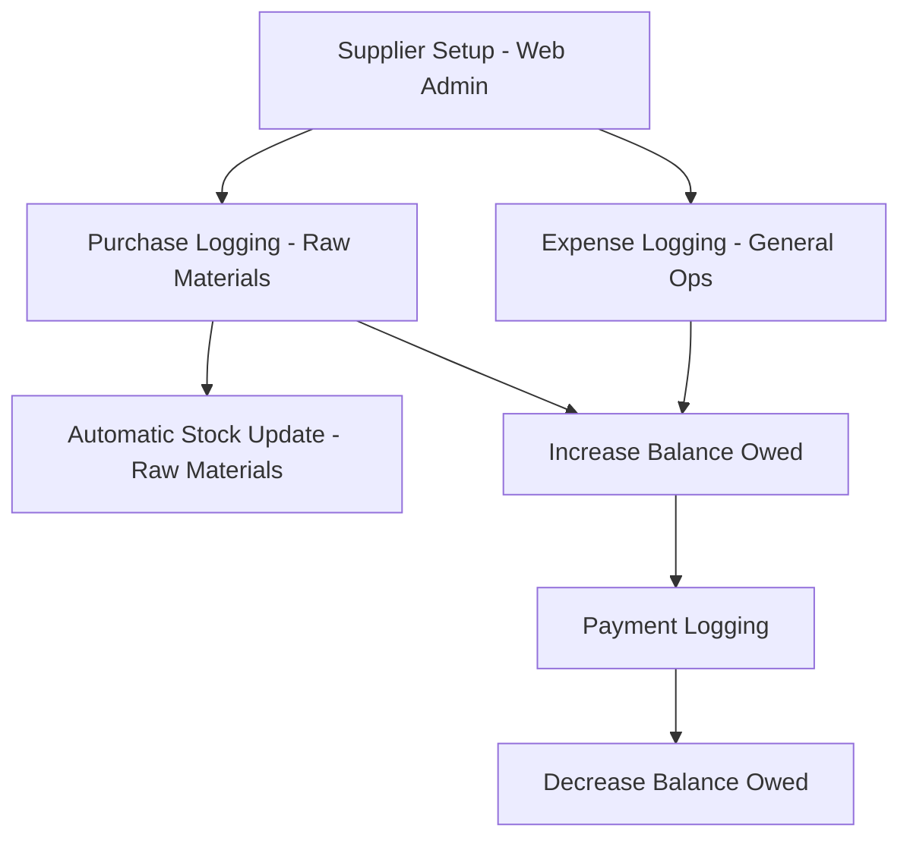

# Procurement Workflow Architecture

The Procurement workflow is an administrative process handled on the web interface by the system Administrator. It manages the intake of raw materials (resins, colorants, packaging) and general operational expenses, while maintaining the financial health of the company's supplier relationships.

## Process Overview

---

## 1. Purchase Intake (Web Interface)
**Primary Actor:** Administrator
**Tool:** `apps/web/app/(authenticated)/company-dealings/purchases/page.js`

Purchases are categorized into two types: **Raw Materials** (which affect inventory) and **General Expenses** (which only affect finance).

### Logging a Purchase
Admin enters data for each transaction, ensuring accuracy for material reconciliation:
- **Supplier:** Selected from a pre-defined list.
- **Material Type:** (e.g., PP Resin, Masterbatch).
- **Quantity & Weight:** Critical for calculating the production yield later.
- **Unit Price & Total Amount:** The basis for accounts payable.
- **System Impact:** Submission automatically increases the **Raw Material balance** for the selected factory.

---

## 2. Supplier Financials (Web Interface)
**Primary Actor:** Administrator
**Tool:** `apps/web/app/(authenticated)/company-dealings/suppliers/page.js`

The system maintains a real-time ledger for each partner to ensure financial transparency.

### Balance Management
- **Opening Balance:** A one-time setup field representing historical debt when the system was initialized.
- **Balance Owed:** This total is automatically incremented with every new purchase and decremented by payments.
- **Ledger View:** A history of all purchases and payments linked to that specific supplier.

---

## 3. Payment Processing (Web Interface)
**Primary Actor:** Administrator
**Tool:** `apps/web/app/(authenticated)/company-dealings/components/PaymentHistoryTab.jsx`

Recording payments is the final step in the procurement loop to keep supplier balances accurate.

- **Payment Mode:** Cash, Bank Transfer, or Check.
- **Reference Number:** Vital for reconciling bank statements.
- **Impact:** Decreases the "Balance Owed" and creates a financial transaction entry in the system history.

---

## Key Rules & Constraints
- **Supplier Requirement:** No purchase can be logged without being linked to a valid supplier record.
- **Factory-Specific Procurement:** Raw materials are assigned to a specific `factory_id` upon purchase.
- **Material-Production Link:** Total resin purchased should theoretically match the total weight of finished goods (tubs/caps/inners) plus waste across all daily logs.
- **Historical Accuracy:** Once a purchase is logged, it typically cannot be deleted without an admin override, ensuring financial integrity.
