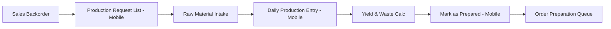

# Production Workflow Architecture

Production is a mobile-primary workflow designed for high-efficiency reporting on the factory floor. It integrates yield calculations, waste tracking, and demand signaling directly into the Production Manager's (PM) handheld experience.

## Process Overview

---

## 1. Demand Signaling (Mobile)
**Actor:** Production Manager
**Tool:** `apps/mobile/lib/features/production/screens/production_requests_screen.dart`

When a Sales Order is created on the Web and contains backordered items, those items automatically surface in the PM's **Production Requests** list.

- **Grouping:** Requests are grouped by Sales Order Number for context.
- **Stock Indicators:** The PM sees current `loose`, `packet`, and `bundle` balances for the requested item.
- **Status:** Items start as `pending` or `in_production`.

---

## 2. Daily Logging (Mobile Only)
**Actor:** Production Manager
**Tool:** `apps/mobile/lib/features/production/screens/production_entry_screen.dart`

Production for Tubs, Caps, and Inners is logged exclusively via the mobile app to ensure real-time accuracy.

### Input Data
- **Machine Selection:** Mapping the production to a specific mechanical asset.
- **Operator Name:** Accountability for the shift.
- **Weights:** Gross Weight, Bag Weight (Tare), and Waste Weight.
- **Metrics:** Downtime minutes for OEE (Overall Equipment Effectiveness) tracking.

### Yield Calculation
The system uses the following logic to derive final inventory units:
1. `Net Weight = Gross Weight - Bag Weight`
2. `Produced Quantity = Net Weight / Ideal Product Weight`
3. Stock is automatically added to the factory's **Loose Item** balance upon submission.

---

## 3. Completion & Prep (The "Mark as Prepared" Step)
**Actor:** Production Manager
**Tool:** `apps/mobile/lib/features/production/screens/production_requests_screen.dart`

Once the required quantity has been manufactured or packaged:
- **Action:** PM clicks **"Mark as Prepared"**.
- **Impact:** This is a status-only signal. It moves the item from the production queue into the **Order Preparation (Reservation)** queue.
- **Constraint:** This action **DOES NOT** reserve stock; it merely signals that the stock is physically ready for reservation.

---

## Key Rules & Constraints
- **Multi-State Inventory:** Production initially populates the `loose` stock state.
- **Cap Specialization:** Caps follow a unique mapping system (`machine_id` + `cap_template_id`).
    - **Mapping Requirement:** Production logging requires a valid mapping defined in Web Admin.
    - **Cycle Time Validation:** Cycle times are automatically derived from the mapping to ensure yield accuracy.
- **Waste Management:** Waste is tracked separately for material reconciliation but does not affect the produced item balance.
