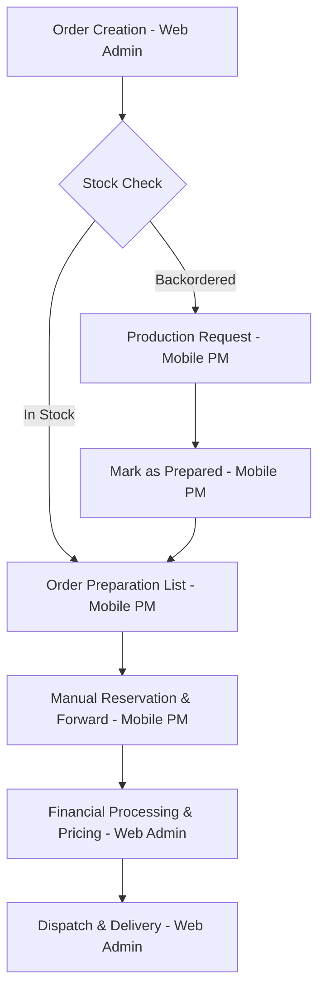

# Sales Workflow Architecture

The Sales workflow is a hybrid process designed to separate financial administration from factory-floor fulfillment. It ensures that stock is only reserved when it is physically ready, preventing over-commitment of inventory.

## Process Overview

---

## 1. Order Intake (Web Interface)
**Primary Actor:** Administrator
**Tool:** `apps/web/app/(authenticated)/orders/page.js`

- **Creation:** Admin selects a customer and adds product items.
- **Stock Validation:** The system automatically checks `loose`, `packet`, and `bundle` balances.
- **Backorder Logic:** If stock is insufficient, the item is flagged as `is_backordered = true`. This triggers an entry in the **Production Requests** system.
- **Initial Status:** `pending`.

---

## 2. Fulfillment Control (Mobile Interface)
**Primary Actor:** Production Manager
**Tool:** `apps/mobile/lib/features/production/screens/order_preparation_screen.dart`

This is the system's "Source of Truth" for physical readiness.

### Preparation & Filtering
The PM sees a list of pending orders. An item only appears in this list if:
1. It is already in stock (`is_backordered = false`).
2. **OR** It was backordered but has been manufactured and marked as `prepared` via the Production Request screen.
3. Items still awaiting production are **HIDDEN** from this view to prevent accidental reservation of non-existent stock.

### Manual Reservation (The Pivot Point)
- **Reservation:** The PM selects the quantities to fulfill and clicks **"Reserve & Forward to Dispatch"**.
- **Impact:** This action calls the `reserveStock` service, which creates technical locks on specific inventory units.
- **Status Change:** The order item status moves to `ready_for_dispatch`.

---

## 3. Dispatch & Finalization (Web Interface)
**Primary Actor:** Administrator
**Tool:** `apps/web/app/(authenticated)/deliveries/page.js`

Once the PM has "Forwarded" the items, they reappear on the Admin's dashboard for final processing.

- **Pricing:** Admin enters the final selling price (often determined at time of delivery).
- **Invoicing:** Any discounts or special charges are added.
- **Payment:** Cash or Credit terms are finalized.
- **Delivery:** Admin marks the order as `delivered`, which clears the reserved stock and updates the customer's ledger.

---

## Key Rules & Constraints
- **Strict Manual Reservation:** Stock is **NEVER** automatically deducted during order creation. It requires the PM's intentional action on the mobile app.
- **Factory Awareness:** Mobile actions are filtered by the PM's assigned `factory_id`.
- **Role Separation:** Admin cannot reserve stock; PM cannot set final pricing or process payments.
