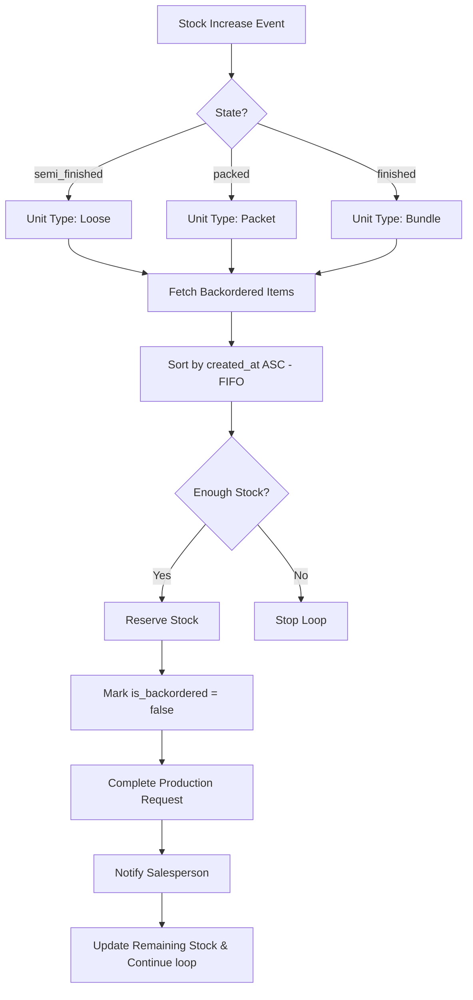

# Smart FIFO Stock Allocation

The `StockAllocationService` is responsible for automatically fulfilling backordered sales orders as new stock becomes available in the warehouse.

## Architecture Overview

The system monitors stock increases in three "ready" states:
1. **Semi-Finished** (Linked to `Loose` sales)
2. **Packed** (Linked to `Packet` sales)
3. **Finished** (Linked to `Bundle` sales)

## Logic Flow

## Key Components

### 1. `reserveStock` vs `reserveFulfillment`
- `reserveStock` is used during initial order creation if stock is already on hand.
- `reserveFulfillment` is used by the background service to move newly produced items directly into a reserved state for a specific order.

### 2. Unit Type Mapping
The service uses a mapping to ensure production output in one state fulfills the correct order unit:
- `semi_finished` -> `loose`
- `packed` -> `packet`
- `finished` -> `bundle`

### 3. Notification Engine
Once a backorder is fulfilled, a `backorder_fulfillment` notification is inserted into the `notifications` table, which triggers real-time alerts in the mobile and web applications.

## Related Services
- `SalesOrderService`: Triggers backorders and production requests.
- `InventoryService`: Triggers the allocation service after `packItems` or `bundlePackets`.
- `ProductionService`: Triggers the allocation service after `production_output` logs.
