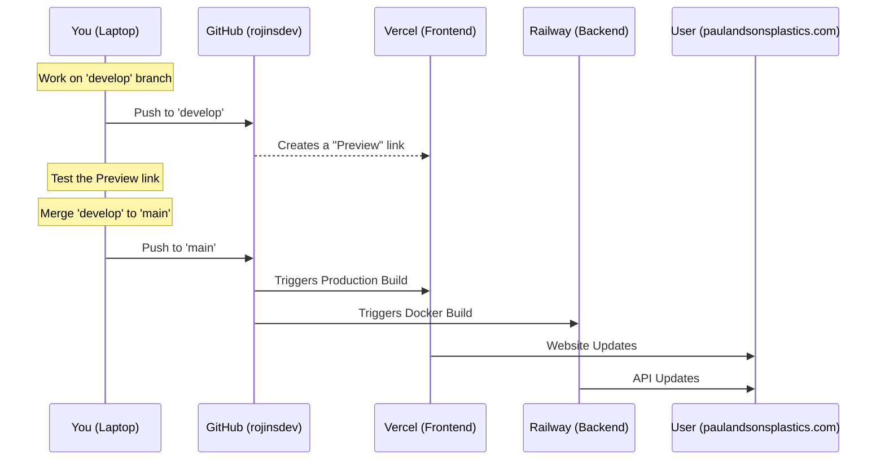

# Infrastructure & Hosting Strategy

This plan outlines the recommended hosting and domain setup for the **Paul & Sons Plastics** system to move from local development to production.

## User Review Required

> [!IMPORTANT]
> The recommendations below prioritize **ease of maintenance**, **low cost**, and **professional scalability**. 

## Proposed Strategy

### 1. The "Whole Flow" (GitHub to Live)

This is how your project stays updated automatically once we set it up:

1.  **Work (in `develop`)**: You write code and push to the `develop` branch. Vercel is smart—it will give you a **private test link** so you can see your changes without the factory staff seeing them.
2.  **Launch (in `main`)**: When you are happy, you move your code to `main`.
3.  **Automated Magic (The Docker Step)**: As soon as `main` hits GitHub:
    - **Frontend (Vercel)**: Vercel handles the build automatically (No Docker needed here).
    - **Backend (Railway/Render)**: This is where **Docker** comes in. The host reads your `Dockerfile`, uses it to **build a Container** (packaging the code), and then runs that container as your live API.
4.  **Zero Downtime**: The old version stays online until the new Docker container is healthy and ready, then it swaps them instantly.

### 2. Domain & DNS Management
For the domain `paulandsonsplastics.com`:

- **Domain Registrar**: Purchase from **Cloudflare**, **Namecheap**, or **Squarespace**.
- **DNS Management**: **Cloudflare** (Highly Recommended).
    - **Why?**: It provides superior security (DDoS protection), speed (Global CDN), and free SSL/TLS certificates.

### 2. Frontend Hosting (Web Portal) - `apps/web`
- **Recommended Platform**: **Vercel**.
- **Reason**: 
    - Designed specifically for **Next.js**.
    - Automatic deployment whenever you push to GitHub.
    - Excellent free tier.

### 3. Backend Hosting (API Server) - `server`
- **Recommended Platform**: **Railway** or **Render**.
- **Reason**:
    - Both handle **Dockerized Node.js** apps perfectly.
    - Simple "pay-as-you-go" or low-cost fixed pricing.

### 4. Database & Platform - `Supabase`
- **Recommendation**: **Stay with Supabase**.
- **Reason**: 
    - You are deeply integrated with Supabase Auth and RLS.

### 5. CI/CD Pipeline (Automated Deployments)
We will use a **GitHub Actions** or **Vercel/Railway native** pipeline:
- Push to GitHub -> Build Docker -> Run Tests -> Deploy.

### 6. Dev vs. Production (Safety First)

| Feature | **Development (Dev)** | **Production (Prod)** |
| :--- | :--- | :--- |
| **Location** | Your Laptop (`localhost`) | `paulandsonsplastics.com` |
| **User** | You (Testing features) | Factory Staff & Admin |
| **Database** | Supabase "Test" branch | Live Supabase Database |

### 7. Safety Mechanisms
- **Environment Variables**: Separate keys for Dev and Prod.
- **Git Branching**: `develop` for work, `main` for live.
- **Migrations**: Blueprints for database changes.

### 8. GitHub Migration
- **Account**: `rojinsdev`
- **Email**: `rojins.dev@gmail.com`
- **Repo**: `https://github.com/rojinsdev/inventory-paulandsonsplastics.git`

### 9. Daily Developer Workflow
- **Work on `develop`**: `git add`, `git commit`, `git push origin develop`.
- **Release to `main`**: `git checkout main`, `git merge develop`, `git push origin main`.

### 10. Mobile App Distribution
- Internal testing via **Firebase App Distribution**.
- Production via **Google Play Store** and **Apple App Store**.
