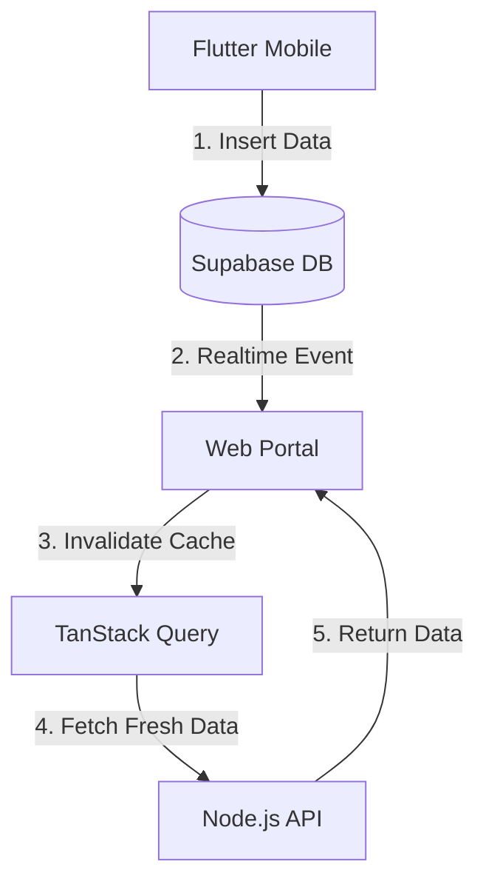

# State Management & Real-time Synchronization

This document explains how the Next.js Web Portal maintains high performance and synchronization with the factory floor (Flutter App) using **TanStack Query** and **Supabase Realtime**.

## 1. Architectural Overview

The system uses a "Pull & Push" architecture to ensure data accuracy:

- **Pull (TanStack Query):** Handles efficient, cached data fetching from the Node.js API.
- **Push (Supabase Realtime):** Receives instant "signals" from the database when changes occur.



## 2. TanStack Query (Caching)

We use TanStack Query to eliminate "Loading" flickers and reduce server load.

### Key Concepts:
- **Query Keys:** Unique identifiers for data (e.g., `['orders', 'reserved']`).
- **Stale Time:** Data is considered "fresh" for 1 minute before checking for updates.
- **Auto-Refetch:** Data is automatically refreshed when the user clicks back into the browser tab.

### Benefits:
- **Instant Navigation:** Moving between Inventory and Dashboard is instantaneous.
- **Global Store:** Data fetched in one component can be reused in another without a second API call.

## 3. Supabase Realtime (Live Sync)

This allows the Web Portal to react to events from the Flutter app or other users without a manual refresh.

### Configuration:
The `supabase_realtime` publication must be enabled in the Supabase Dashboard for:
- `production_logs`
- `raw_materials`
- `sales_orders`
- `stock_balances`

### Implementation:
We use a global `useRealtime` hook ([hooks/useRealtime.js](file:///d:/WORKS/SAAS/PaulAndSonsPlastics/inventory-production-system/apps/web/hooks/useRealtime.js)) that listens for `INSERT`, `UPDATE`, and `DELETE` events.

When an event is detected:
1. The hook identifies the table that changed.
2. It calls `queryClient.invalidateQueries({ queryKey: [...] })`.
3. TanStack Query refetches just that specific data in the background.

## 4. Usage in Components

### Fetching Data:
```javascript
const { data, isLoading } = useQuery({
    queryKey: ['raw-materials'],
    queryFn: () => inventoryAPI.getRawMaterials()
});
```

### Updating Data (Mutations):
```javascript
const mutation = useMutation({
    mutationFn: (data) => api.update(data),
    onSuccess: () => {
        // This ensures the local list updates immediately
        queryClient.invalidateQueries({ queryKey: ['raw-materials'] });
    }
});
```

## 5. Developer Best Practices
- **Never use `useEffect` for fetching:** Always use `useQuery`.
- **Always Invalidate:** After any `POST`, `PUT`, or `DELETE` action, invalidate the relevant query key.
- **Specific Keys:** Use objects in query keys `['orders', { status: 'reserved' }]` to allow granular invalidation.
